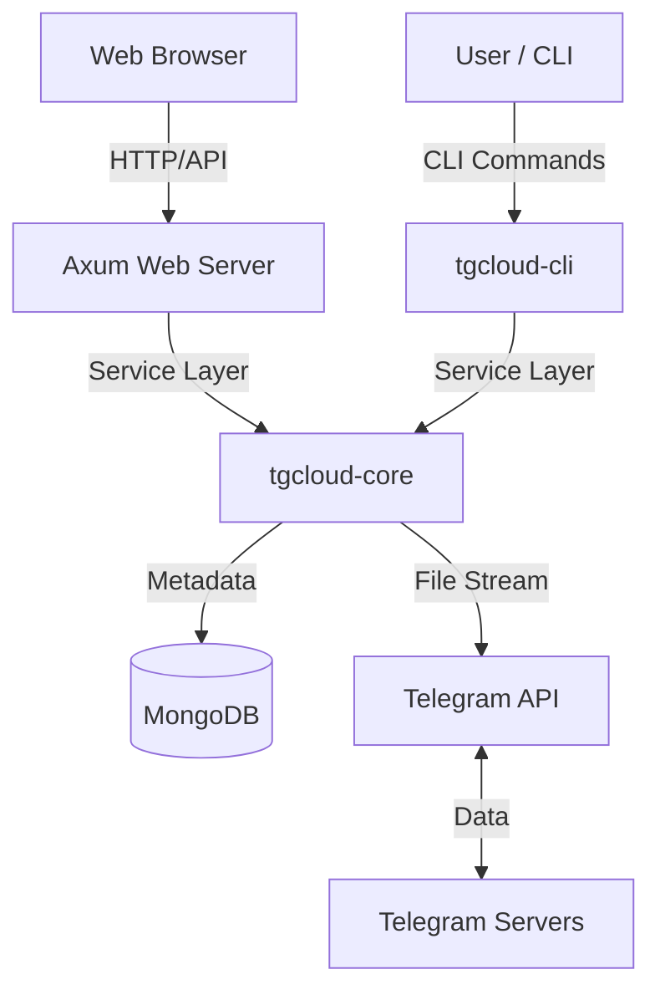

# TG-Cloud 🚀

**TG-Cloud** is a production-grade, distributed storage system that leverages the Telegram Bot API as a secure and unlimited file backend. It provides a seamless CLI experience and a modern Web GUI to manage files with high-performance streaming and robust metadata persistence via MongoDB.

---

## 🌟 The Mission
Cloud storage often comes with steep costs, complex API hurdles, or privacy concerns. **TG-Cloud** exists to solve this by transforming Telegram into a manageable, structured, and developer-friendly storage layer. It provides the abstractions needed to treat Telegram messages as objects in a filesystem, complete with path-based organization and "foul-proof" management.

---

## ✨ Key Features
- **Modern Web GUI**: A clean, Google Drive-inspired single-page interface for intuitive file management.
- **Unlimited Storage Backend**: Uses Telegram’s `sendDocument` API to store files up to 2GB per chunk.
- **Micro-Service Ready Core**: Modular Rust workspace with a clean separation between the logic library (`tgcloud-core`) and the terminal interface (`tgcloud-cli`).
- **Rich CLI UX**: High-fidelity progress bars, speed trackers, ETAs, and beautiful data tables.
- **Integrity First**: Automatic SHA-256 hashing and file size verification on every upload and download.
- **Foul-Proof Hardening**: Robust ID-based rename and delete operations that ensure reliability across the entire stack.
- **Local-Fetch Download**: Files are fetched and reconstructed on the server's local cache, optimized for server-side processing.

---

## 🛠 Tech Stack
- **[Rust](https://www.rust-lang.org/)**: Chosen for memory safety, performance, and best-in-class async support.
- **[Axum](https://github.com/tokio-rs/axum)**: A modular, high-performance web framework for the GUI backend.
- **[Askama](https://github.com/djc/askama)**: Type-safe, compiled Jinja-like templates for the UI.
- **[Tokio](https://tokio.rs/)**: The industry-standard async runtime for concurrent operations.
- **[MongoDB](https://www.mongodb.com/)**: Scalable, JSON-friendly metadata persistence.
- **[reqwest](https://docs.rs/reqwest/)**: Robust HTTP client for interacting with the Telegram Bot API.

---

## 🏗 System Architecture

### High-Level Interaction


---

## 🚀 Getting Started

### Prerequisites
- [Rust](https://rustup.rs/) (Stable)
- [MongoDB](https://www.mongodb.com/try/download/community) (Local or Atlas)
- One Telegram Bot (created via [@BotFather](https://t.me/BotFather))
- A target Telegram Chat ID (where files will be stored)

### Installation
1. Clone the repository:
   ```bash
   git clone https://github.com/angel2rider/tgcloud.git
   cd tgcloud
   ```
2. Build the project:
   ```bash
   cargo build --release
   ```

### Configuration
TG-Cloud uses a user-centric configuration system. On the first run, it will create a configuration directory.
1. Create a `.env` file at `~/.config/tgcloud/.env`:
```bash
# Required: MongoDB Connection String
MONGO_URI=mongodb://localhost:27017

# Required: Target Chat ID
TELEGRAM_CHAT_ID=-100xxxxxxxx

# Telegram Bot API URL (Standard or Local Server)
TELEGRAM_API_URL=https://api.telegram.org

# Required: Telegram Bot ID and Token
BOT_ID=123456789
BOT_TOKEN=1234567890:ABC-DEF1234567890
```

---

## 💻 Usage

### 🌐 Launch Web GUI
Start the modern web interface at `http://localhost:8090`:
```bash
tgcloud --gui
```
*Features: Drag-and-drop upload, inline rename, delete, and human-readable metadata display.*

### ⌨️ CLI Commands

#### Upload a file
```bash
tgcloud upload /path/to/my_file.zip
```

#### List files
```bash
tgcloud list root
```

#### Download a file
Fetches the file to the server's local Document cache:
```bash
tgcloud download remote_filename
```

#### Rename (Robust ID-based)
```bash
tgcloud rename old_name new_name
```

#### Hard Delete
```bash
tgcloud delete filename
```

---

## 📸 Screenshots

### Web GUI (Single-Page Dashboard)


---

## 🗺 Roadmap
- [x] **MODERN WEB GUI**: Native dashboard for file management.
- [x] **CHUNKED UPLOADS**: Support for files larger than 2GB.
- [x] **ROBUST PATHS**: ID-based file management for extreme reliability.
- [x] **CORE REFACTOR**: User-centric configuration directory.

---

## 📜 License
Distributed under the MIT License. See `LICENSE` for more information.

---
**Built with ❤️ and Rust for the community.**
