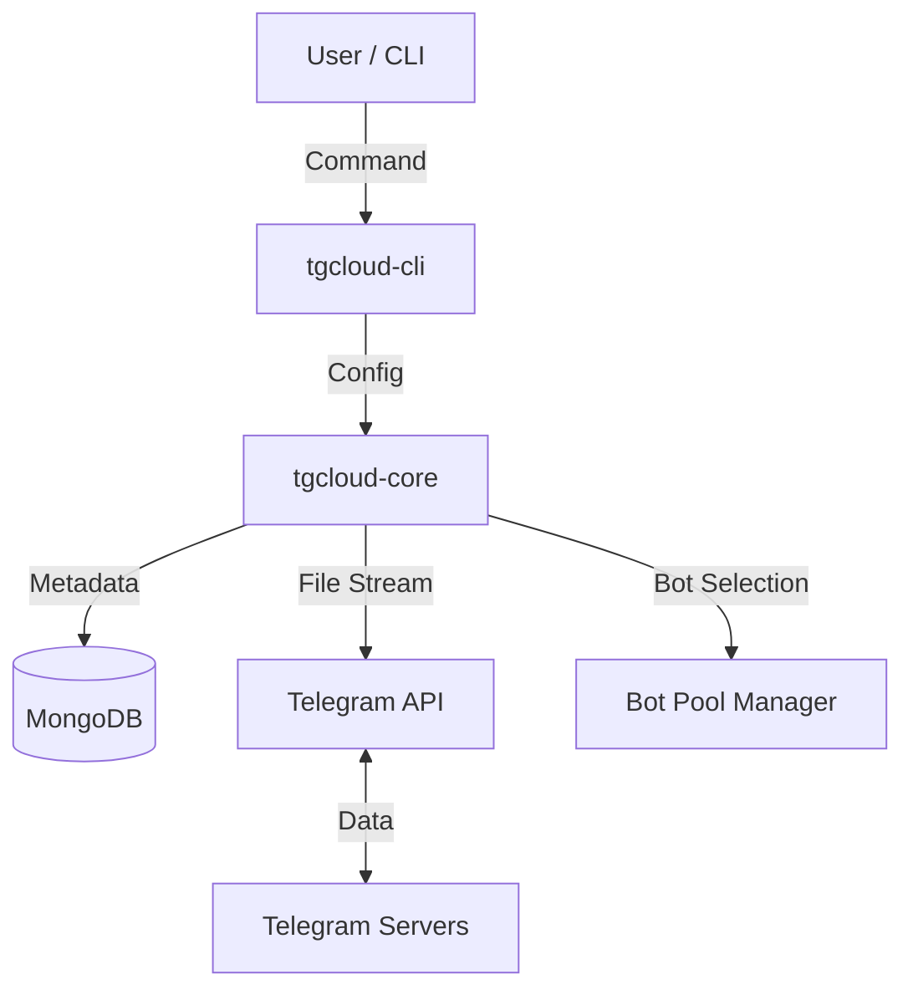

# TG-Cloud 🚀

**TG-Cloud** is a production-grade, distributed storage system that leverages the Telegram Bot API as a secure and unlimited file backend. It provides a seamless CLI experience to manage files with high-performance streaming, robust metadata persistence via MongoDB, and intelligent bot load balancing.

---

## 🌟 The Mission
Cloud storage often comes with steep costs, complex API hurdles, or privacy concerns. **TG-Cloud** exists to solve this by transforming Telegram into a manageable, structured, and developer-friendly storage layer. It provides the abstractions needed to treat Telegram messages as objects in a filesystem, complete with path-based organization and hard deletion capabilities.

---

## ✨ Key Features
- **Unlimited Storage Backend**: Uses Telegram’s `sendDocument` API to store files up to 2GB.
- **Micro-Service Ready Core**: Modular Rust workspace with a clean separation between the logic library (`tgcloud-core`) and the terminal interface (`tgcloud-cli`).
- **Intelligent Bot Orchestration**: Automatically load balances uploads across a pool of bots to distribute traffic and bypass rate limits.
- **Rich CLI UX**: High-fidelity progress bars, speed trackers, ETAs, and beautiful data tables.
- **Integrity First**: Automatic SHA-256 hashing and file size verification on every upload.
- **Hard Deletion & Atomic Rename**: Supports one-click hard deletion (Telegram + Database) and instant metadata renaming.
- **Streaming Architecture**: Fully asynchronous I/O with streaming uploads and downloads to minimize memory footprint.

---

## 🛠 Tech Stack
- **[Rust](https://www.rust-lang.org/)**: Chosen for memory safety, performance, and best-in-class async support.
- **[Tokio](https://tokio.rs/)**: The industry-standard async runtime for concurrent operations.
- **[MongoDB](https://www.mongodb.com/)**: Scalable, JSON-friendly metadata persistence.
- **[reqwest](https://docs.rs/reqwest/)**: Robust HTTP client for interacting with the Telegram Bot API.
- **[indicatif](https://docs.rs/indicatif/)**: For creating fluid, state-of-the-art terminal progress animations.
- **[comfy-table](https://docs.rs/comfy-table/)**: For generating stylized, responsive data tables in the CLI.

---

## 🏗 System Architecture

### High-Level Interaction


### Internal Data Flow
1. **Upload**: CLI streams file to `tgcloud-core` -> Core selects least-used Bot -> Streams to Telegram -> Captures `file_id` + `message_id` -> Hashes file -> Saves Meta to MongoDB.
2. **Download**: Core fetches metadata from MongoDB -> Retrieves Bot Token -> Resolves Download URL from Telegram -> Streams bytes directly to disk.
3. **Delete**: Core identifies `message_id` -> Commands Telegram to `deleteMessage` -> Removes MongoDB record upon success.

---

## 📂 Project Structure
```text
.
├── tgcloud-core/          # Core logic library (Infrastructure Agnostic)
│   ├── src/
│   │   ├── bot_manager.rs # Load balancing logic
│   │   ├── config.rs      # Configuration models
│   │   ├── storage.rs     # MongoDB persistence layer
│   │   ├── telegram.rs    # Bot API client (Streaming)
│   │   └── service.rs     # Main Orchestrator
├── tgcloud-cli/           # Terminal User Interface
│   ├── src/
│   │   ├── ui.rs          # Styling, themes, and animations
│   │   └── main.rs        # CLI entry point and event loop
├── Cargo.toml             # Workspace configuration
└── .env                   # Configuration file (Local)
```

---

## 🚀 Getting Started

### Prerequisites
- [Rust](https://rustup.rs/) (Stable)
- [MongoDB](https://www.mongodb.com/try/download/community) (Local or Atlas)
- One or more Telegram Bots (created via [@BotFather](https://t.me/BotFather))
- A target Telegram Chat ID (where files will be stored)

### Installation
1. Clone the repository:
   ```bash
   git clone https://github.com/yourusername/tgcloud.git
   cd tgcloud
   ```
2. Build the project:
   ```bash
   cargo build --release
   ```

### Configuration
Create a `.env` file in the root directory:
```bash
# Required: MongoDB Connection String
MONGO_URI=mongodb://localhost:27010

# Required: Target Chat ID (group, channel, or your ID)
TELEGRAM_CHAT_ID=-100xxxxxxxx

# Telegram Bot API URL (Standard or Local Server)
TELEGRAM_API_URL=https://api.telegram.org

# Configure Bots (JSON Array)
BOTS_JSON='[{"bot_id":"123","token":"123:ABC"}, {"bot_id":"456","token":"456:DEF"}]'

# OR Single Bot (legacy support)
# BOT_ID=123
# BOT_TOKEN=123:ABC
```

---

## 💻 Usage

### Upload a file
```bash
tgcloud upload /path/to/my_file.zip
```
*Visuals: Shows a spinner for hashing followed by a dynamic progress bar.*

### List files in a virtual folder
```bash
tgcloud list root
```
*Visuals: Displays a styled table with Path, Size, Bot ID, and Creation Date.*

### Download a file
```bash
tgcloud download remote/path/file.zip ./local_file.zip
```

### Rename (Metadata Only)
```bash
tgcloud rename old/path.txt new/path.txt
```

### Hard Delete
```bash
tgcloud delete path/to/file.zip
```
*Note: This deletes the message from Telegram servers and the record from the database.*

---

## 📸 Screenshots
*(Coming Soon - Placeholders for high-fidelity CLI output screenshots)*
> 
> 

---

## 🗺 Roadmap
- [ ] **FUSE Mount**: Mount TG-Cloud as a local virtual drive.
- [ ] **Chunking**: Support for files larger than 2GB (automatic splitting).
- [ ] **GUI Dashboard**: Web-based interface for file management.
- [ ] **Encryption**: End-to-end client-side AES-256 encryption.

---

## 🤝 Contributing
1. Fork the project.
2. Create your feature branch (`git checkout -b feature/AmazingFeature`).
3. Commit your changes (`git commit -m 'Add some AmazingFeature'`).
4. Push to the branch (`git push origin feature/AmazingFeature`).
5. Open a Pull Request.

---

## 📜 License
Distributed under the MIT License. See `LICENSE` for more information.

---
**Built with ❤️ and Rust for the community.**
